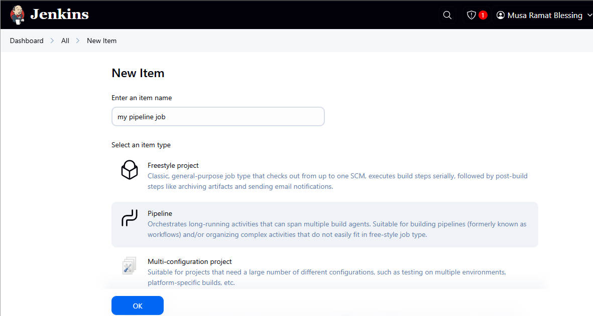
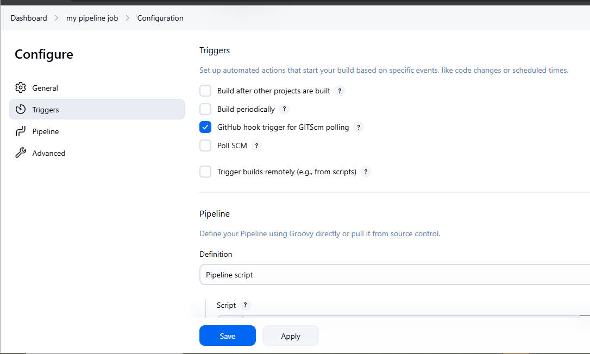
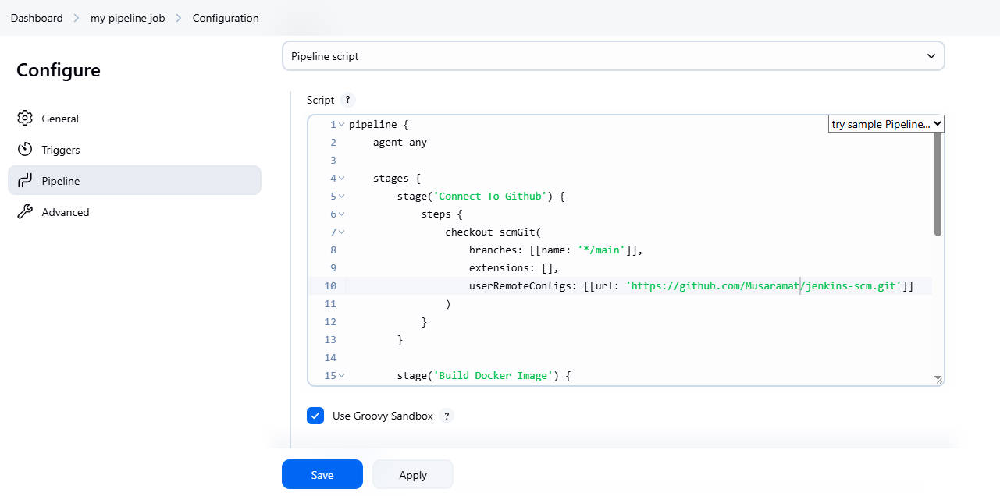
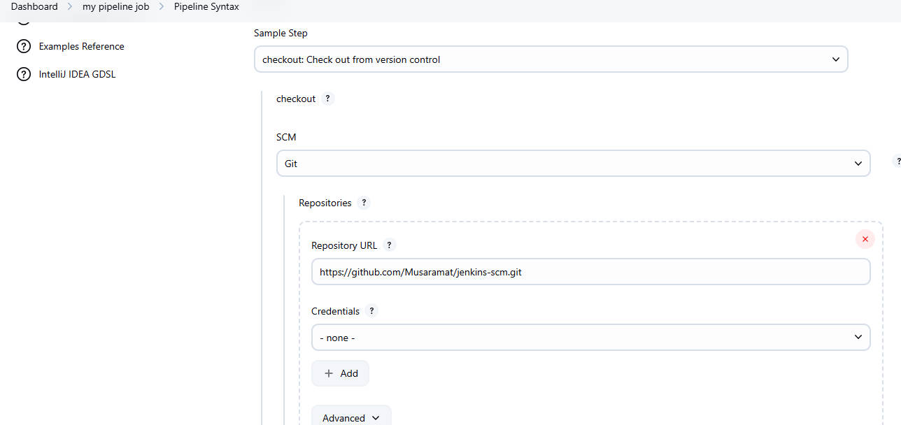
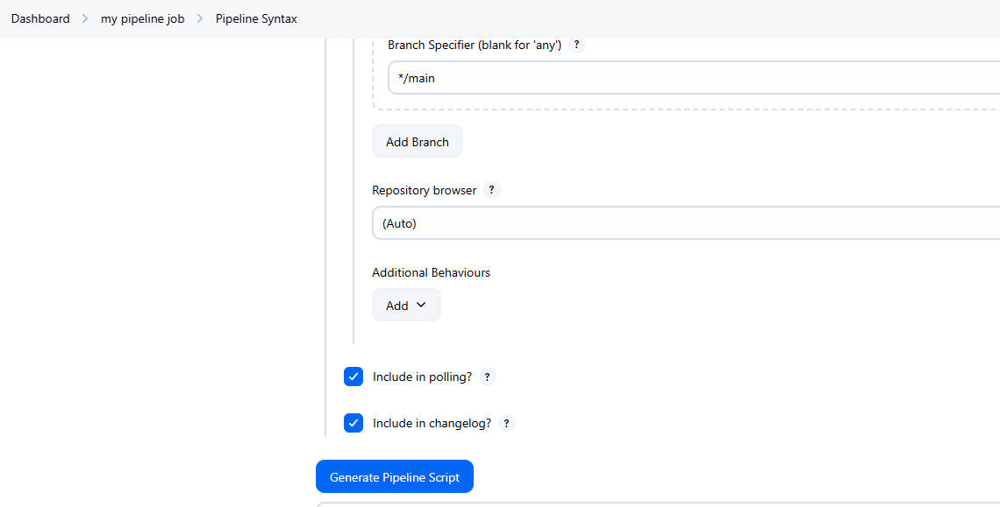
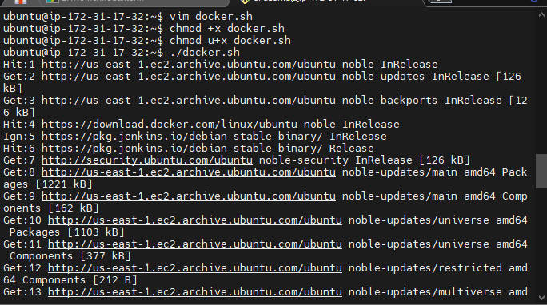
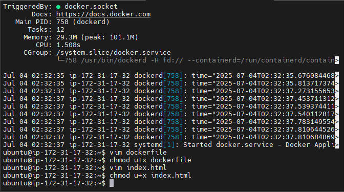

# pipeline
## Jenkins pipeline job is a way to defined and automate a series of steps in the software delivery process, it allows the you to script and organised your entire build, test and deployment.

